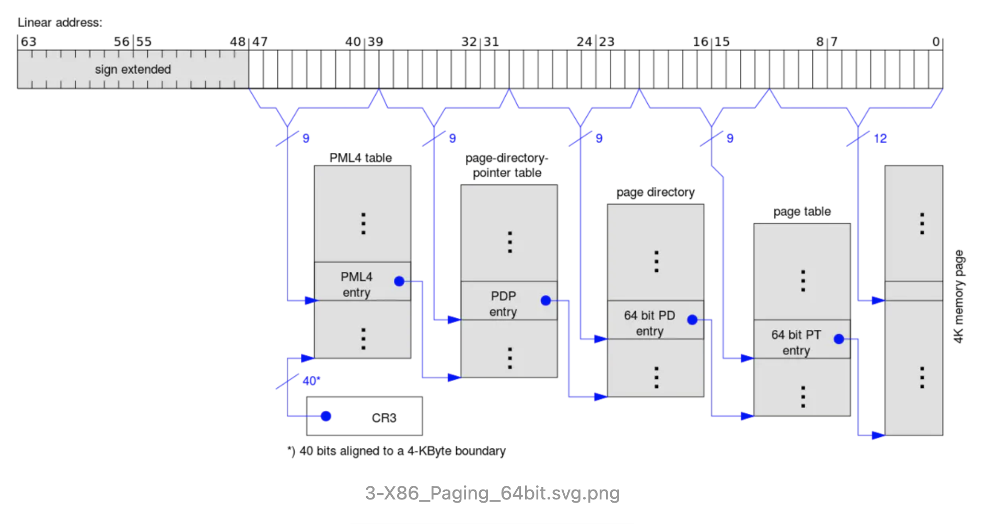

# KVM

> https://www.jianshu.com/p/5ec4507e9be0
>
> https://lwn.net/Articles/658511/

​	KVM本身是Linux内核的一个模块，是基于虚拟化扩展（Intel VT 和 AMD-V）的x86硬件的开源的Linux原生虚拟化解决方案，KVM本身不执行任何的硬件模拟。

​	现代CPU本身实现了对特殊指令的重定向和截取，一些经过虚拟化支持处理的CPU带有特定的虚拟化指令集来帮助实现虚拟化，通过这些指令集，vmm可以很好的限制虚拟机，比如虚拟机访问硬件资源的时候，CPU就可以中断虚拟机的请求然后将控制权转交给vmm进行处理。**这也是KVM实现虚拟机I/O劫持的一个重要原理。**

> kvm虚拟机代码里面有相关注释解析

## long mode转换

> https://wiki.osdev.org/Setting_Up_Long_Mode

1. 首先要检测cpu是否支持long mode,可以通过判断flags寄存器的第22位是否被置为1来判断

~~~assembly
; Check if CPUID is supported by attempting to flip the ID bit (bit 21) in
    ; the FLAGS register. If we can flip it, CPUID is available.
 
    ; Copy FLAGS in to EAX via stack
    pushfd
    pop eax
 
    ; Copy to ECX as well for comparing later on
    mov ecx, eax
 
    ; Flip the ID bit
    xor eax, 1 << 21
 
    ; Copy EAX to FLAGS via the stack
    push eax
    popfd
 
    ; Copy FLAGS back to EAX (with the flipped bit if CPUID is supported)
    pushfd
    pop eax
 
    ; Restore FLAGS from the old version stored in ECX (i.e. flipping the ID bit
    ; back if it was ever flipped).
    push ecx
    popfd
 
    ; Compare EAX and ECX. If they are equal then that means the bit wasn't
    ; flipped, and CPUID isn't supported.
    xor eax, ecx
    jz .NoCPUID
    ret
~~~

2. 判断long mode是否已经被使用了，其实就是判断0x80000000以上的地址是否可用，然后检测相关标志位

~~~assembly
mov eax, 0x80000000    ; Set the A-register to 0x80000000.
    cpuid                  ; CPU identification.
    cmp eax, 0x80000001    ; Compare the A-register with 0x80000001.
    jb .NoLongMode         ; It is less, there is no long mode.
~~~

~~~assembly
    mov eax, 0x80000001    ; Set the A-register to 0x80000001.
    cpuid                  ; CPU identification.
    test edx, 1 << 29      ; Test if the LM-bit, which is bit 29, is set in the D-register.
    jz .NoLongMode         ; They aren't, there is no long mode.
~~~

3. 进入long mode，在这之前首先要关闭保护模式，清楚cr0的第31bit，然后就可以开始设置进入64为模式

~~~assembly
    mov eax, cr0                                   ; Set the A-register to control register 0.
    and eax, 01111111111111111111111111111111b     ; Clear the PG-bit, which is bit 31.
    mov cr0, eax                                   ; Set control register 0 to the A-register.
~~~

​		首先，long mode会用到PAE ，所以你必须设置一个指针执行它，同时设置页目录项和页表项，大致如下：



​		这里面有四种表：`PML4T`,`PDPD`,`PDT`,`PT` ，每个`PM4L` 指向`PDPT` ，每个`PDPT` 指向`PDT`，每个`PDT`指向`PT` 。

​		控制寄存机cr*用于设置分页属性，比如cr3指向物理地址`pmlt` ，cr0保护模式，写保护等等，cr1访问它的时候会报`undefined behavior` 错误，cr2用于设置页错误线程地址PFLA，当发生页错误的时候，将被访问的地址存于`CR2`，CR3页目录基地址寄存器，若设置CR0的PG位，则CR3高20位存第一个页目录入口的物理地址，若设置CR4的PCIDE位，则低12位用于进程上下文标识符PCID；CR4—SMEP、SMAP等；CR5-7—保留）。

>  控制寄存器：https://en.wikipedia.org/wiki/Control_register

## hypervisor

> 这里是根据源码调试该项目，帮助捋清一个基础虚拟化平台的逻辑

所需要的：

* hypervisor
* kernel
* Target_elf

主要步骤：

1. 首先将kernel装载到虚拟化平台
2. 在kernel中运行相关文件

### 装载kernel

1. 利用read_file函数将kernel文件读取到内存里面，然后进去kvm_init函数，进行初始化。
2. 检验kvm版本。
3. 利用kvm创建虚拟机,然后将kernel的机器码全部读取到为虚拟机创建的内存里面。
4. 初始化cpu，并为cpu分配内存

CPU这个结构体还是蛮重要的，刚开始几乎全部被初始化为0：

~~~c
pwndbg> p *(struct kvm_run*) 0x7ffff7fc6000
$6 = {
  request_interrupt_window = 0 '\000',
  immediate_exit = 0 '\000',
  padding1 = "\000\000\000\000\000",
  exit_reason = 0,
  ready_for_interrupt_injection = 0 '\000',
  if_flag = 0 '\000',
  flags = 0,
  cr8 = 0,
  apic_base = 0,
  {
    hw = {
      hardware_exit_reason = 0
    },
    fail_entry = {
      hardware_entry_failure_reason = 0
    },
    ex = {
      exception = 0,
      error_code = 0
    },
    io = {
      direction = 0 '\000',
      size = 0 '\000',
      port = 0,
      count = 0,
      data_offset = 0
    },
    debug = {
      arch = {
        exception = 0,
        pad = 0,
        pc = 0,
        dr6 = 0,
        dr7 = 0
      }
    },
    mmio = {
      phys_addr = 0,
      data = "\000\000\000\000\000\000\000",
      len = 0,
      is_write = 0 '\000'
    },
    hypercall = {
      nr = 0,
      args = {0, 0, 0, 0, 0, 0},
      ret = 0,
      longmode = 0,
      pad = 0
    },
    tpr_access = {
      rip = 0,
      is_write = 0,
      pad = 0
    },
    s390_sieic = {
      icptcode = 0 '\000',
      ipa = 0,
      ipb = 0
    },
    s390_reset_flags = 0,
    s390_ucontrol = {
      trans_exc_code = 0,
      pgm_code = 0
    },
    dcr = {
      dcrn = 0,
      data = 0,
      is_write = 0 '\000'
    },
    internal = {
      suberror = 0,
      ndata = 0,
      data = {0 <repeats 16 times>}
    },
    osi = {
      gprs = {0 <repeats 32 times>}
    },
    papr_hcall = {
      nr = 0,
      ret = 0,
      args = {0, 0, 0, 0, 0, 0, 0, 0, 0}
    },
    s390_tsch = {
      subchannel_id = 0,
      subchannel_nr = 0,
      io_int_parm = 0,
      io_int_word = 0,
      ipb = 0,
      dequeued = 0 '\000'
    },
    epr = {
      epr = 0
    },
    system_event = {
      type = 0,
      flags = 0
    },
    s390_stsi = {
      addr = 0,
      ar = 0 '\000',
      reserved = 0 '\000',
      fc = 0 '\000',
      sel1 = 0 '\000',
      sel2 = 0
    },
    eoi = {
      vector = 0 '\000'
    },
    hyperv = {
      type = 0,
      pad1 = 0,
      u = {
        synic = {
          msr = 0,
          pad2 = 0,
          control = 0,
          evt_page = 0,
          msg_page = 0
        },
        hcall = {
          input = 0,
          result = 0,
          params = {0, 0}
        }
      }
    },
    padding = '\000' <repeats 255 times>
  },
  kvm_valid_regs = 0,
  kvm_dirty_regs = 0,
  s = {
    regs = {
      regs = {
        rax = 0,
        rbx = 0,
        rcx = 0,
        rdx = 0,
        rsi = 0,
        rdi = 0,
        rsp = 0,
        rbp = 0,
        r8 = 0,
        r9 = 0,
        r10 = 0,
        r11 = 0,
        r12 = 0,
        r13 = 0,
        r14 = 0,
        r15 = 0,
        rip = 0,
        rflags = 0
      },
      sregs = {
        cs = {
          base = 0,
          limit = 0,
          selector = 0,
          type = 0 '\000',
          present = 0 '\000',
          dpl = 0 '\000',
          db = 0 '\000',
          s = 0 '\000',
          l = 0 '\000',
          g = 0 '\000',
          avl = 0 '\000',
          unusable = 0 '\000',
          padding = 0 '\000'
        },
        ds = {
          base = 0,
          limit = 0,
          selector = 0,
          type = 0 '\000',
          present = 0 '\000',
          dpl = 0 '\000',
          db = 0 '\000',
          s = 0 '\000',
          l = 0 '\000',
          g = 0 '\000',
          avl = 0 '\000',
          unusable = 0 '\000',
          padding = 0 '\000'
        },
        es = {
          base = 0,
          limit = 0,
          selector = 0,
          type = 0 '\000',
          present = 0 '\000',
          dpl = 0 '\000',
          db = 0 '\000',
          s = 0 '\000',
          l = 0 '\000',
          g = 0 '\000',
          avl = 0 '\000',
          unusable = 0 '\000',
          padding = 0 '\000'
        },
        fs = {
          base = 0,
          limit = 0,
          selector = 0,
          type = 0 '\000',
          present = 0 '\000',
          dpl = 0 '\000',
          db = 0 '\000',
          s = 0 '\000',
          l = 0 '\000',
          g = 0 '\000',
          avl = 0 '\000',
          unusable = 0 '\000',
          padding = 0 '\000'
        },
        gs = {
          base = 0,
          limit = 0,
          selector = 0,
          type = 0 '\000',
          present = 0 '\000',
          dpl = 0 '\000',
          db = 0 '\000',
          s = 0 '\000',
          l = 0 '\000',
          g = 0 '\000',
          avl = 0 '\000',
          unusable = 0 '\000',
          padding = 0 '\000'
        },
        ss = {
          base = 0,
          limit = 0,
          selector = 0,
          type = 0 '\000',
          present = 0 '\000',
          dpl = 0 '\000',
          db = 0 '\000',
          s = 0 '\000',
          l = 0 '\000',
          g = 0 '\000',
          avl = 0 '\000',
          unusable = 0 '\000',
          padding = 0 '\000'
        },
        tr = {
          base = 0,
          limit = 0,
          selector = 0,
          type = 0 '\000',
          present = 0 '\000',
          dpl = 0 '\000',
          db = 0 '\000',
          s = 0 '\000',
          l = 0 '\000',
          g = 0 '\000',
          avl = 0 '\000',
          unusable = 0 '\000',
          padding = 0 '\000'
        },
        ldt = {
          base = 0,
          limit = 0,
          selector = 0,
          type = 0 '\000',
          present = 0 '\000',
          dpl = 0 '\000',
          db = 0 '\000',
          s = 0 '\000',
          l = 0 '\000',
          g = 0 '\000',
          avl = 0 '\000',
          unusable = 0 '\000',
          padding = 0 '\000'
        },
        gdt = {
          base = 0,
          limit = 0,
          padding = {0, 0, 0}
        },
        idt = {
          base = 0,
          limit = 0,
          padding = {0, 0, 0}
        },
        cr0 = 0,
        cr2 = 0,
        cr3 = 0,
        cr4 = 0,
        cr8 = 0,
        efer = 0,
        apic_base = 0,
        interrupt_bitmap = {0, 0, 0, 0}
      },
      events = {
        exception = {
          injected = 0 '\000',
          nr = 0 '\000',
          has_error_code = 0 '\000',
          pending = 0 '\000',
          error_code = 0
        },
        interrupt = {
          injected = 0 '\000',
          nr = 0 '\000',
          soft = 0 '\000',
          shadow = 0 '\000'
        },
        nmi = {
          injected = 0 '\000',
          pending = 0 '\000',
          masked = 0 '\000',
          pad = 0 '\000'
        },
        sipi_vector = 0,
        flags = 0,
        smi = {
          smm = 0 '\000',
          pending = 0 '\000',
          smm_inside_nmi = 0 '\000',
          latched_init = 0 '\000'
        },
        reserved = '\000' <repeats 26 times>,
        exception_has_payload = 0 '\000',
        exception_payload = 0
      }
    },
    padding = '\000' <repeats 2047 times>
  }
}
~~~

5. 创建vm结构体，将cpu内存，普通内存，cpu，等这些关键信息赋值给它。

~~~c
  VM *vm = (VM*) malloc(sizeof(VM));
  *vm = (struct VM){
    .mem = mem,
    .mem_size = MEM_SIZE,
    .vcpufd = vcpufd,
    .run = run
  };
~~~

~~~c
pwndbg> p *(VM *) 0x55555555daa0
$8 = {
  mem = 0x7ffff79c3000,
  mem_size = 4194304,
  vcpufd = 5,
  run = 0x7ffff7fc6000
}
~~~

6. 为虚拟设置结构体。

结构体set之前：

~~~c
pwndbg> p regs
$9 = {
  rax = 0,
  rbx = 0,
  rcx = 0,
  rdx = 1536,
  rsi = 0,
  rdi = 0,
  rsp = 0,
  rbp = 0,
  r8 = 0,
  r9 = 0,
  r10 = 0,
  r11 = 0,
  r12 = 0,
  r13 = 0,
  r14 = 0,
  r15 = 0,
  rip = 65520,
  rflags = 2
}
~~~

结构体set之后：

~~~c
pwndbg> p regs
$10 = {
  rax = 0,
  rbx = 0,
  rcx = 0,
  rdx = 1536,
  rsi = 2097152,
  rdi = 2097152,
  rsp = 2097152,
  rbp = 0,
  r8 = 0,
  r9 = 0,
  r10 = 0,
  r11 = 0,
  r12 = 0,
  r13 = 0,
  r14 = 0,
  r15 = 0,
  rip = 0,
  rflags = 2
}
~~~

7. 将cpu转换到long mode以便运行64位汇编程序。

   1. 转换过程中首先设置页表

   首先拿出sregs:

   ~~~c
   pwndbg> p sregs 
   $12 = {
     cs = {
       base = 4294901760,
       limit = 65535,
       selector = 61440,
       type = 11 '\v',
       present = 1 '\001',
       dpl = 0 '\000',
       db = 0 '\000',
       s = 1 '\001',
       l = 0 '\000',
       g = 0 '\000',
       avl = 0 '\000',
       unusable = 0 '\000',
       padding = 0 '\000'
     },
     ds = {
       base = 0,
       limit = 65535,
       selector = 0,
       type = 3 '\003',
       present = 1 '\001',
       dpl = 0 '\000',
       db = 0 '\000',
       s = 1 '\001',
       l = 0 '\000',
       g = 0 '\000',
       avl = 0 '\000',
       unusable = 0 '\000',
       padding = 0 '\000'
     },
     es = {
       base = 0,
       limit = 65535,
       selector = 0,
       type = 3 '\003',
       present = 1 '\001',
       dpl = 0 '\000',
       db = 0 '\000',
       s = 1 '\001',
       l = 0 '\000',
       g = 0 '\000',
       avl = 0 '\000',
       unusable = 0 '\000',
       padding = 0 '\000'
     },
     fs = {
       base = 0,
       limit = 65535,
       selector = 0,
       type = 3 '\003',
       present = 1 '\001',
       dpl = 0 '\000',
       db = 0 '\000',
       s = 1 '\001',
       l = 0 '\000',
       g = 0 '\000',
       avl = 0 '\000',
       unusable = 0 '\000',
       padding = 0 '\000'
     },
     gs = {
       base = 0,
       limit = 65535,
       selector = 0,
       type = 3 '\003',
       present = 1 '\001',
       dpl = 0 '\000',
       db = 0 '\000',
       s = 1 '\001',
       l = 0 '\000',
       g = 0 '\000',
       avl = 0 '\000',
       unusable = 0 '\000',
       padding = 0 '\000'
     },
     ss = {
       base = 0,
       limit = 65535,
       selector = 0,
       type = 3 '\003',
       present = 1 '\001',
       dpl = 0 '\000',
       db = 0 '\000',
       s = 1 '\001',
       l = 0 '\000',
       g = 0 '\000',
       avl = 0 '\000',
       unusable = 0 '\000',
       padding = 0 '\000'
     },
     tr = {
       base = 0,
       limit = 65535,
       selector = 0,
       type = 11 '\v',
       present = 1 '\001',
       dpl = 0 '\000',
       db = 0 '\000',
       s = 0 '\000',
       l = 0 '\000',
       g = 0 '\000',
       avl = 0 '\000',
       unusable = 0 '\000',
       padding = 0 '\000'
     },
     ldt = {
       base = 0,
       limit = 65535,
       selector = 0,
       type = 2 '\002',
       present = 1 '\001',
       dpl = 0 '\000',
       db = 0 '\000',
       s = 0 '\000',
       l = 0 '\000',
       g = 0 '\000',
       avl = 0 '\000',
       unusable = 0 '\000',
       padding = 0 '\000'
     },
     gdt = {
       base = 0,
       limit = 65535,
       padding = {0, 0, 0}
     },
     idt = {
       base = 0,
       limit = 65535,
       padding = {0, 0, 0}
     },
     cr0 = 1610612752,
     cr2 = 0,
     cr3 = 0,
     cr4 = 0,
     cr8 = 0,
     efer = 0,
     apic_base = 4276095232,
     interrupt_bitmap = {0, 0, 0, 0}
   }
   ~~~

   然后在虚拟机的MAX_KERNEL_SIZE（0x1f7000）范围之外的内存设置pml4和pdb和pd并设置相关的标志位,然后设置段寄存器，修改完成之后的段寄存器：

   ~~~c
   pwndbg> p sregs
   $26 = {
     cs = {
       base = 0,
       limit = 4294967295,
       selector = 8,
       type = 11 '\v',
       present = 1 '\001',
       dpl = 0 '\000',
       db = 0 '\000',
       s = 1 '\001',
       l = 1 '\001',
       g = 1 '\001',
       avl = 0 '\000',
       unusable = 0 '\000',
       padding = 0 '\000'
     },
     ds = {
       base = 0,
       limit = 4294967295,
       selector = 16,
       type = 3 '\003',
       present = 1 '\001',
       dpl = 0 '\000',
       db = 0 '\000',
       s = 1 '\001',
       l = 1 '\001',
       g = 1 '\001',
       avl = 0 '\000',
       unusable = 0 '\000',
       padding = 0 '\000'
     },
     es = {
       base = 0,
       limit = 4294967295,
       selector = 16,
       type = 3 '\003',
       present = 1 '\001',
       dpl = 0 '\000',
       db = 0 '\000',
       s = 1 '\001',
       l = 1 '\001',
       g = 1 '\001',
       avl = 0 '\000',
       unusable = 0 '\000',
       padding = 0 '\000'
     },
     fs = {
       base = 0,
       limit = 4294967295,
       selector = 16,
       type = 3 '\003',
       present = 1 '\001',
       dpl = 0 '\000',
       db = 0 '\000',
       s = 1 '\001',
       l = 1 '\001',
       g = 1 '\001',
       avl = 0 '\000',
       unusable = 0 '\000',
       padding = 0 '\000'
     },
     gs = {
       base = 0,
       limit = 4294967295,
       selector = 16,
       type = 3 '\003',
       present = 1 '\001',
       dpl = 0 '\000',
       db = 0 '\000',
       s = 1 '\001',
       l = 1 '\001',
       g = 1 '\001',
       avl = 0 '\000',
       unusable = 0 '\000',
       padding = 0 '\000'
     },
     ss = {
       base = 0,
       limit = 4294967295,
       selector = 16,
       type = 3 '\003',
       present = 1 '\001',
       dpl = 0 '\000',
       db = 0 '\000',
       s = 1 '\001',
       l = 1 '\001',
       g = 1 '\001',
       avl = 0 '\000',
       unusable = 0 '\000',
       padding = 0 '\000'
     },
     tr = {
       base = 0,
       limit = 65535,
       selector = 0,
       type = 11 '\v',
       present = 1 '\001',
       dpl = 0 '\000',
       db = 0 '\000',
       s = 0 '\000',
       l = 0 '\000',
       g = 0 '\000',
       avl = 0 '\000',
       unusable = 0 '\000',
       padding = 0 '\000'
     },
     ldt = {
       base = 0,
       limit = 65535,
       selector = 0,
       type = 2 '\002',
       present = 1 '\001',
       dpl = 0 '\000',
       db = 0 '\000',
       s = 0 '\000',
       l = 0 '\000',
       g = 0 '\000',
       avl = 0 '\000',
       unusable = 0 '\000',
       padding = 0 '\000'
     },
     gdt = {
       base = 0,
       limit = 65535,
       padding = {0, 0, 0}
     },
     idt = {
       base = 0,
       limit = 65535,
       padding = {0, 0, 0}
     },
     cr0 = 2147811379,
     cr2 = 0,
     cr3 = 2060288,
     cr4 = 1568,
     cr8 = 0,
     efer = 1281,
     apic_base = 4276095232,
     interrupt_bitmap = {0, 0, 0, 0}
   }
   ~~~

   此时vm中的kernel初始化完成，开始加载可执行文件：

8. 将elf名称和其参数压入vm栈中，将vm中参数距离起始位置的偏移也记录在栈里面，同时参数的个数也被记录在栈里面。然后更新rsp为

   1. ~~~c
      regs.rsp = sp - (char*) vm->mem;
      ~~~

9. 接下来进行虚拟机代码执行阶段。

   1. ~~~c
      void execute(VM* vm) {
        while(1) {
          ioctl(vm->vcpufd, KVM_RUN, NULL);
          dump_regs(vm->vcpufd);
          switch (vm->run->exit_reason) {
          case KVM_EXIT_HLT:
            fprintf(stderr, "KVM_EXIT_HLT\n");
            return;
          case KVM_EXIT_IO:
            if(!check_iopl(vm)) error("KVM_EXIT_SHUTDOWN\n");
            if(vm->run->io.port & HP_NR_MARK) {
              if(hp_handler(vm->run->io.port, vm) < 0) error("Hypercall failed\n");
            }
            else error("Unhandled I/O port: 0x%x\n", vm->run->io.port);
            break;
          case KVM_EXIT_FAIL_ENTRY:
            error("KVM_EXIT_FAIL_ENTRY: hardware_entry_failure_reason = 0x%llx\n",
              vm->run->fail_entry.hardware_entry_failure_reason);
          case KVM_EXIT_INTERNAL_ERROR:
            error("KVM_EXIT_INTERNAL_ERROR: suberror = 0x%x\n",
              vm->run->internal.suberror);
          case KVM_EXIT_SHUTDOWN:
            error("KVM_EXIT_SHUTDOWN\n");
          default:
            error("Unhandled reason: %d\n", vm->run->exit_reason);
          }
        }
      }
      ~~~

10. 开始进入kernel分析阶段。

### kernel

#### 用户空间和内核空间

​	内核空间和用户空间的一个很大的不同就是一些指令只能在用户空间执行，如hlt和wrmsr，两种模式通过段寄存器中的dpl(descriptor privilege level 优先级描述符)来进行区分，用户模式下cs.dpl=3，内核模式下cs.dpl=0。

​	一般来说在hypervisor中是不需要有用户可以直接接触到的页的，但是内核里面是可以的，因此一般要设置页表的第三位，使得用户空间可以访问页表。

#### syscall

​	有一个特殊寄存器可以允许syscall/sysenter指令执行，通过EFER(Extended Feature Enable Register)可以控制指令是否被开启，同时可以设置MSR寄存器来进行syscall的注册，在hypervisor中可以通过ioctl和vcpufd获取和设置MSR寄存器，但是在内核里面需要用rdmsr和wrmsr指令来操作MSR寄存器。

```c
// 注册syscall处理函数
  lea rdi, [rip+syscall_handler]
  call set_handler
syscall_handler:
  // handle syscalls!
set_handler:
  mov eax, edi
  mov rdx, rdi
  shr rdx, 32
  /* input of msr is edx:eax */
  mov ecx, 0xc0000082 /* MSR_LSTAR, Long Syscall TARget */
  wrmsr
  ret
```

​	其中`0xc0000082`是用来确定具体的MSR寄存器，可以把它当做一个下标来对待，通过上面的汇编就可以完成对于一个syscall的跳转实现。**但是syscall指令并不是只会修改rip，它会把返回地址放在rcx里面，把r11设置为rflag，同时也会改变段寄存器ss和cs**.

​	但是在syscall执行的过程中还存在对于内核空间和用户空间的切换。

~~~assembly
register_syscall:
  xor rax, rax # 这里是通过MSR，为内核和用户进行cs值的注册。
  mov rdx, 0x00200008
  mov ecx, 0xc0000081 /* MSR_STAR */
  wrmsr

  mov eax, 0x3f7fd5
  xor rdx, rdx
  mov ecx, 0xc0000084 /* MSR_SYSCALL_MASK */
  wrmsr

  lea rdi, [rip + syscall_handler] /*注册处理函数 */
  mov eax, edi
  mov rdx, rdi
  shr rdx, 32
  mov ecx, 0xc0000082 /* MSR_LSTAR */
  wrmsr
~~~

handle函数的具体实现：

~~~assembly
.globl syscall_handler, kernel_stack
.extern do_handle_syscall
.intel_syntax noprefix

kernel_stack: .quad 0 /* initialize it before the first time switching into user-mode */
user_stack: .quad 0

syscall_handler:
  mov [rip + user_stack], rsp
  mov rsp, [rip + kernel_stack]
  /* save non-callee-saved registers */
  push rdi
  push rsi
  push rdx
  push rcx
  push r8
  push r9
  push r10
  push r11

  /* the forth argument */
  mov rcx, r10
  call do_handle_syscall

  pop r11
  pop r10
  pop r9
  pop r8
  pop rcx
  pop rdx
  pop rsi
  pop rdi

  mov rsp, [rip + user_stack]
  .byte 0x48 /* REX.W prefix, to indicate sysret is a 64-bit instruction */
  sysret
~~~

> 注意，syscall/sysret不会修改栈指针rsp，所以要手动的push pop

#### Hypercall

​	因此是在虚拟机环境里面，因此内核一定需要和hypervisor进行通信，在此例子中使用`out/in`指令作为hypercall，用out指令向stdout打印字节，其实还可以进行拓展。

~~~c
#define HP_NR_MARK 0x8000

#define NR_HP_open  (HP_NR_MARK | 0)
#define NR_HP_read  (HP_NR_MARK | 1)
#define NR_HP_write  (HP_NR_MARK | 2)
#define NR_HP_close  (HP_NR_MARK | 3)
#define NR_HP_lseek  (HP_NR_MARK | 4)
#define NR_HP_exit  (HP_NR_MARK | 5)

#define NR_HP_panic (HP_NR_MARK | 0x7fff)
~~~

对应的处理为：

~~~c
while (1) {
  ioctl(vm->vcpufd, KVM_RUN, NULL);
  switch (vm->run->exit_reason) {
  /* other cases omitted */
  case KVM_EXIT_IO:
    // putchar(*(((char *)vm->run) + vm->run->io.data_offset));
    if(vm->run->io.port & HP_NR_MARK) {
      switch(vm->run->io.port) {
      case NR_HP_open: hp_handle_open(vm); break;
      /* other cases omitted */
      default: errx(1, "Invalid hypercall");
    }
    else errx(1, "Unhandled I/O port: 0x%x", vm->run->io.port);
    break;
  }
}
~~~

那么在内核里面如何触发？hypercall

~~~c
/* kernel/hypercalls/hp_open.c */
int hp_open(uint32_t filename_paddr) {
  int ret = 0;
  asm(
    "mov dx, %[port];" /* hypercall number */
    "mov eax, %[data];"
    "out dx, eax;" /* trigger hypervisor to handle the hypercall */
    "in eax, dx;"  /* get return value of the hypercall */
    "mov %[ret], eax;"
    : [ret] "=r"(ret)
    : [port] "r"(NR_HP_open), [data] "r"(filename_paddr)
    : "rax", "rdx"
  );
  return ret;
}
~~~


