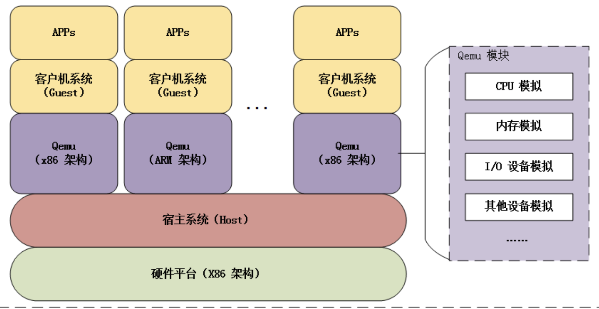
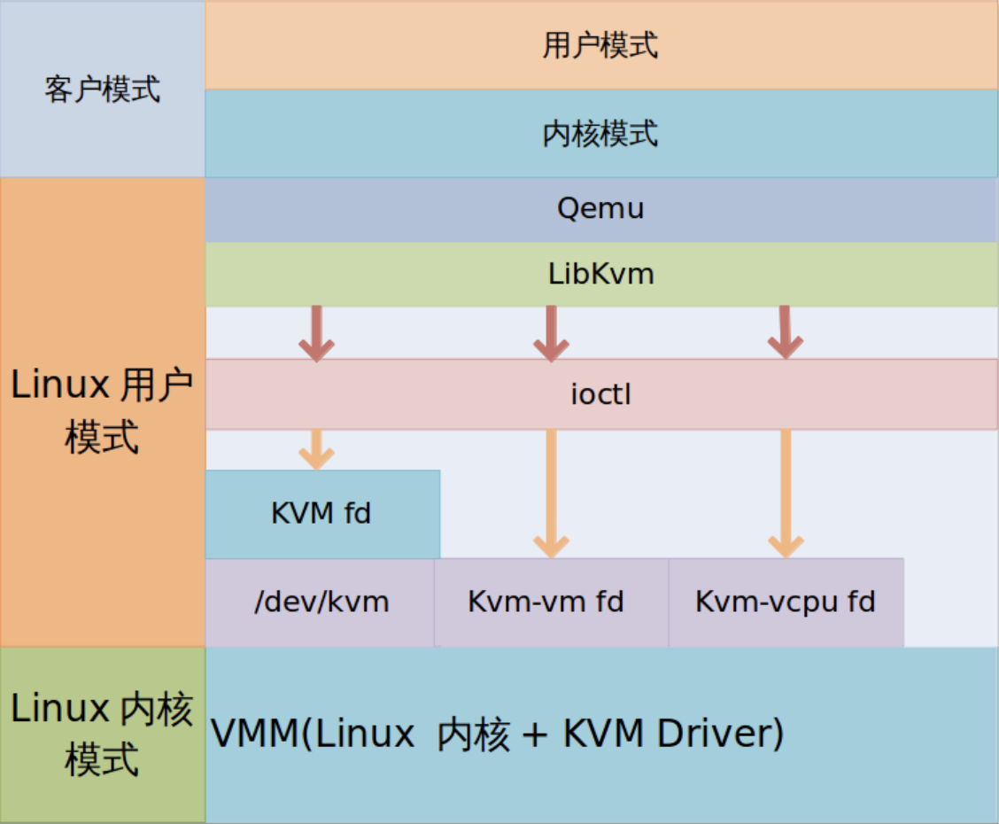

# 谈谈虚拟化

## 什么是qemu?

​	Qemu是一种虚拟化模拟器，它几乎可以模拟任何硬件设备，比如我们可以利用qemu模拟出来一台虚拟机来运行某个操作系统，在这台虚拟机中，操作系统误以为自己在直接和硬件打交道，其实操作系统所需要运行的指令都由qemu翻译给真正的硬件来执行，这样的好处是显而易见的，通过qemu的这一个虚拟层，软硬件在匹配度上面的要求大大降低，这使得人们在测试软件的时候不再被平台束缚手脚。

## 什么是虚拟化？

​	现在我们已经知道qemu是一个虚拟化模拟器，用来模拟硬件设备，那么什么是虚拟化呢？其实，虚拟化是一种资源管理技术，如果一个机器不存在虚拟化，那么机器中的单个操作系统管理和使用所有的硬件设备，但是如果一个机器可以支持虚拟化，那么就可以对硬件资源进行抽象然后形成可以用于多个操作系统的实体，多个实体可以共享硬件资源，增大对于硬件资源的利用率。

​	为了实现虚拟化，必须存在`Virtual Machine Motior(VMM)` 即虚拟机监视器，也叫`Hypevisor` ,它的作用就是管理实际的物理资源，同时给不同的虚拟机提供逻辑资源。

​	同时虚拟化存在很多概念，我们对一些主要概念进行解读。

### 软件虚拟化

​	通过软件模拟来实现VMM层，比如qemu（上面已经讲过什么是qemu）。

### 硬件虚拟化

​	区别于软件虚拟化，硬件虚拟化直接使用硬件来提供虚拟化能力，相比于软件虚拟化的指令翻译，硬件虚拟化显然可以直接提高系统整体的性能，因为硬件虚拟化处理器本身提供能力来让客户机指令独立运行。这里就必须要提一下KVM，也叫`Kernel-Based Virtual Machine` ,简单翻译就是基于内核的虚拟机，它实现了对CPU和内存的虚拟化以及对硬件I/O虚拟化的拦截，比如客户机的I/O会被KVM拦截，然后交给qemu去处理。同时，KVM是一个内核的Module，这使得Linux可以作为一个`Hypevisor`，因为是硬件的虚拟化，因为KVM需要来自硬件的支持，比如`intel VT`，`AMD-V`等等。

### 半虚拟化和全虚拟化

​	当一个操作系统知道自己运行在一个虚拟化的环境里面，并且为了在这个虚拟化的环境里面表现出更好的性能而做出定制化的修改，那么这就是半虚拟化，它的缺点在于需要对客户机和宿主机都进行一些修改，比如安装某些特定的驱动，它的优势就在于因为这些定制化的修改可以使得性能有所提升。

​	那么当一个操作系统在运行的时候不知道自己处在一个虚拟化的环境里面，而是以为自己直接在和硬件进行打交道，那么这就是全虚拟化，它的缺点在于为了模拟出和物理平台一样的环境给操作系统`Hypevisor`的设计难度大大增加，同时在整体的性能表现上也略差，那么它的优点就在于客户机操作系统不需要进行定制化修改，大大的增加了用户的好感度，使用非常简单。

### Type1虚拟化和Type2虚拟化

​	通过虚拟化的实现是直接在硬件层面还是软件层面，可以将虚拟化分为Type1虚拟化和Type2虚拟化，如果`Hypevisor`直接控制硬件和客户机，比如典型的`Xen`，那么这就是Type1虚拟化，如果`Hypevisor`直接运行在宿主机操作系统上，比如VMware 和 KVM，此时`Hypevisor`只是操作系统上的一个应用程序，那么这就是Type2虚拟化。

## 虚拟化是怎么实现的？

> 这个问题异常的庞大和复杂，笔者只能根据自己的能力对这个问题进行尽量细致的讲解，如有错误，还望指正。

### qemu架构

​	为了理解qemu的实现，我们首先要清楚qemu的架构。qemu由纯软件的方式实现，这是自然，因为qemu本身的意义就在于减轻对于硬件的依赖。同时我们还要思考一个问题，在没有qemu之前，指令直接交由cpu等硬件执行，但是存在qemu之后，执行要首先经过qemu，然后由qemu翻译给硬件执行，显而易见，这必然将大大的拖累执行效率，因此qemu有一个很严重的问题就是拖累性能。

​	为了解决这个问题，qemu通过配合KVM来完成虚拟化工作，KVM是硬件辅助的虚拟化技术，它负责CPU和内存虚拟化，qemu负责I/O虚拟化，通过这一架构设计整个虚拟化的过程中qemu和KVM充分发挥自身的优势来削弱虚拟化带来的性能损耗。

图示qemu架构：

​	通过上图可以知道，qemu通过在宿主系统上模拟不同的架构来运行不同的客户级操作系统，既然是在宿主系统上运行，我们很容易猜到qemu模拟出的每一个客户机操作系统实际上都是对应的宿主机上面的一个进程，如果在虚拟机中执行线程(cpu线程，i/o线程等)对应qemu进程的一个线程。

图示qemu内存：

~~~
Guest' processes
+--------------------+
Virtual addr space   |                    |
+--------------------+
|                    |
                     \__   PageTable     \__
                        \                    \
|                    |  Guest kernel
+----+--------------------+----------------+
Guest's phy. memory |    |                    |                |
+----+--------------------+----------------+
|                                          |
                    \__                                        \__
                       \                                          \
|             QEMU process                 |
+----+------------------------------------------+
Virtual addr space |    |                                          |
+----+------------------------------------------+
|                                               |
                    \__                PageTable                   \__
                       \                                               \
|                                               |
+----+-----------------------------------------------++
Physical memory    |    |                                               ||
+----+-----------------------------------------------++
~~~

​	qemu的内存设计其实就是一次叠加，我们知道在物理机上虚拟地址通过一些内存机制比如分页机制来和物理地址进行对应，在qemu中它重复了这个过程，qemu把虚拟地址当做物理地址，然后同样通过一些机制产生新的虚拟地址提供给qemu中的进程。

​	现在我们已经大致说了qemu大致的设计思路，还有一点值得思考，qemu和KVM是如何配合的？

### qemu-kvm架构

​	首先根据虚拟化中的分类，显然，`qemu-kvm架构`是一种Type2虚拟化，同时也是一种全虚拟化解决方案。

图示qemu-kvm架构：

​	通过这个架构图我们其实可以了解到，qemu其实是负责虚拟化方案的用户态组成部分，它存在两种模式，其一是模拟各种硬件，利用的是二进制的翻译技术，另一个是通过ioctl和内核模块kvm进行交互，完成虚拟化功能。

​	qemu为每一个客户机创建一个进程，同时针对每一个虚拟的cpu（也叫vcpu）创建一个线程，然后客户机的操作系统就运行在vcpu之上，同时在该架构中，qemu还负责相应I/O操作，客户机中的I/O操作会进入KVM进行判断然后转交给qemu，然后qemu模拟I/O设备来相应客户机中的I/O请求。

​	KVM内核模块依赖于硬件的虚拟化支持，主要是用来初始化CPU硬件，开启虚拟化模式从而使得客户机可以运行在虚拟化环境之中，同时它实现了内存和CPU的虚拟化并且拥有硬件支持，这就是为什么qemu+KVM架构会有更加良好的性能表现。

### 虚拟化中的硬件支持

​	qemu-kvm架构离不开硬件的支持

> https://www.cnblogs.com/LoyenWang/p/13584020.html

​	