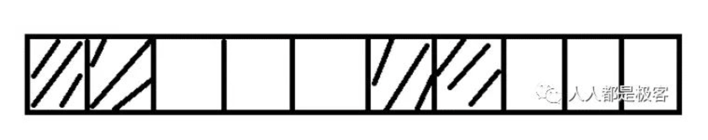
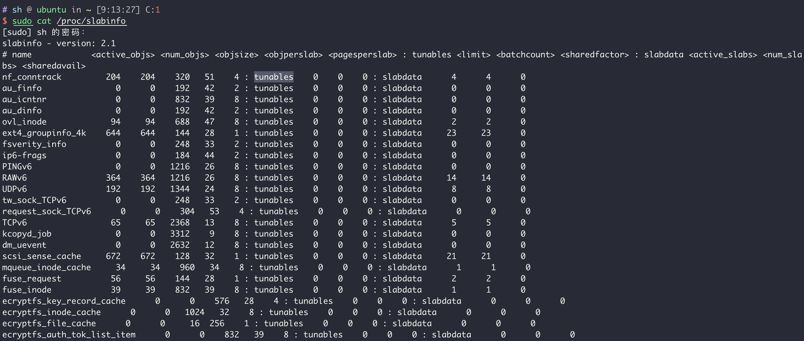
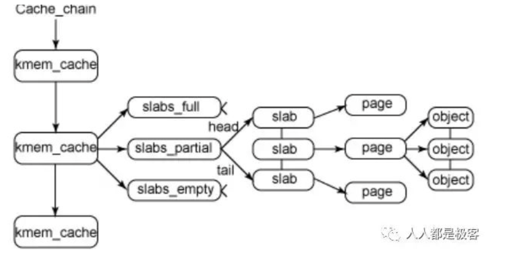
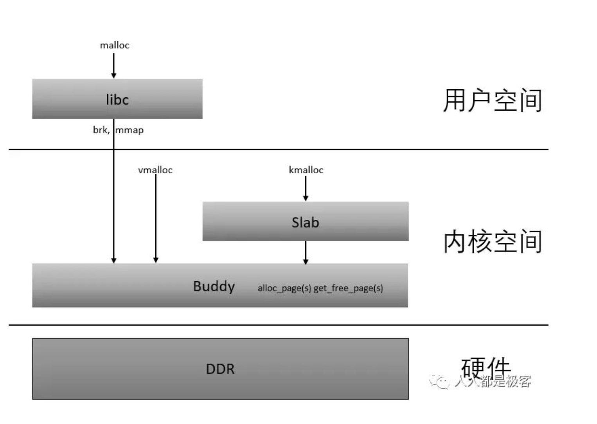

# Linux 内核内存管理与漏洞利用（笔记）

> https://paper.seebug.org/1153/
>
> https://zhuanlan.zhihu.com/p/36140017
>
> http://brieflyx.me/2020/heap/linux-kernel-slab-101/

## 伙伴系统

主要思想是将大块内存按照一定策略不断拆分（在到达最小的块之前），直至存在满足指定请求大小的最小块。其中块的大小由其相对根块的位置指定，通常称为order（阶）。

为什么叫buddy system呢？假设一个大块A所分解成的两个小块B和C，其中B和C就相互为彼此的  buddy。只有彼此的buddy才能够进行合并。

假设这是一段连续的页框，阴影部分表示已经被使用的页框，现在需要申请一个连续的5个页框。这个时候，在这段内存上不能找到连续的5个空闲的页框，就会去另一段内存上去寻找5个连续的页框，这样子，久而久之就形成了页框的浪费。为了避免出现这种情况，Linux内核中引入了伙伴系统算法(Buddy system)。

### Linux实现

Linux中，buddy system 分配的底层API主要有`get_free_pages`和`alloc_pages`，传入的参数都是`order`和一些flag位。

值得注意的是这样分配得到的虚拟地址和物理地址都是连续的，返回的地址可以使用 `virts_to_phys` 或者 `__pa` 宏转换为物理地址，实际操作也就是加上了一个偏移而已。

可以通过 `/proc/buddyinfo` 和 `/proc/pagetypeinfo` 来查看相关的情况.

上面是Linux中部分的`kmem_cache`，以nf_conntrack为例子

- active_objs: 目前使用中的object数量，一共分配出了204个objects.
- num_objs: 总共能够分配的object数量，这里最大是204个.
- objsize: 每个object的大小，这里是320 bytes.
- objperslab: 每个slab可以有多少个object，这里是51个.
- pagesperslab: 每个slab对应几个page，这里是4个.

### 相关API

~~~c
struct kmem_cache * kmem_cache_create (	const char *name,
 	size_t  	size,
 	size_t  	align,
 	unsigned long  	flags,
 	void (*ctor(void*, struct kmem_cache *, unsigned long),
 	void (*dtor(void*, struct kmem_cache *, unsigned long));
~~~

创建mem_cache，需要指定name和size。

~~~c
void * kmem_cache_alloc (struct kmem_cache * cachep, gfp_t flags);
~~~

在mem_cache中分配object，这里不需要指定size因为在创建时就已经指定好了.

~~~c
void kmem_cache_free (struct kmem_cache * cachep, void * objp);
~~~

在mem_cache中释放object.

~~~c
void * kmalloc (size_t size, gfp_t flags);
~~~

分配size大小的对象，会在 `kmalloc-xxx` 这些特殊的mem_cache里找到一个适合的进行分配.
如果size超过了最大的kmalloc mem_cache，比如上面那个slabinfo里最大的是 `kmalloc-8192`，如果分配超过8192 bytes的话，还是会调用底层API直接向buddy申请内存.

~~~c
void kfree (const void * objp);
~~~

释放对象 `objp` ，实际会先找到其所在的page，然后读取page结构中指向其所属slab的指针，进而放到对应的freelist（单链表）中，并将指向freelist中下一块的fd指针写到块的头部.

## Slab

上面说到，由于效率原因，伙伴系统中分配内存是以页为单位的，即使所分配的object大小为1byte，也需要分配一页，这样就导致了比较大的内存碎片。因此Linux引入了Slab分配器，加速对object的分配和释放速度，同时也减少碎片空间。

### page

描述一个页的数据结构就是`struct page`。其使用了大量的union结构，针对不同用处的页使用不同的字段。

Slab是一个或者多个连续页组成的内存空间，那么本质上指向Slab数据结构的不是别的，而是`struct page *`。

### kmem_cache

~~~c
  /*
   * Slab cache management.
   */
  struct kmem_cache {
      struct kmem_cache_cpu __percpu *cpu_slab;
      /* Used for retriving partial slabs etc */
      unsigned long flags;
      unsigned long min_partial;
      int size;       /* The size of an object including meta data */
      int object_size;    /* The size of an object without meta data */
      int offset;     /* Free pointer offset. */
  #ifdef CONFIG_SLUB_CPU_PARTIAL
      int cpu_partial;    /* Number of per cpu partial objects to keep around */
  #endif
      ...
      struct kmem_cache_node *node[MAX_NUMNODES];
}
~~~

kmem_cache是Slab的主要管理结构，申请和释放对象都需要经过该数据结构的操作，上面是部分重要字段。

* `cpu_slab` 包含当前CPU的Slab，
* node数组中包括其他CPU的Slab。为什么叫做node？其实这是NUMA系统中的node概念。NUMA是为了多核优化而产生的架构，可以令某个CPU访问某段内存的速度更快。node的定义是“一段内存，其中每个字节到CPU的距离相等”

### kmem_cache_cpu

cpu_slab是`kmem_cache_cpu`结构：

~~~c
struct kmem_cache_cpu {
      void **freelist;    /* Pointer to next available object */
      unsigned long tid;  /* Globally unique transaction id */
      struct page *page;  /* The slab from which we are allocating */
  #ifdef CONFIG_SLUB_CPU_PARTIAL
      struct page *partial;   /* Partially allocated frozen slabs */
  #endif
  #ifdef CONFIG_SLUB_STATS
      unsigned stat[NR_SLUB_STAT_ITEMS];
  #endif
  };
~~~

## 分配和释放

对象的分配和释放涉及到几个指针，分别是：

- p1: 对象的虚拟地址(`void *`)
- p2: 对象地址所对应的page(`struct page*`)
- p3: 对象所属的slab(`struct page*`)
- p4: 对象所属的cache控制体(`struct kmem_cache*`)

kmem_cache是一个cache_chain的链表，描述了一个高速缓存，每个高速缓存包含了一个slabs的列表，这通常是一段连续的内存块。存在3种slab：

- slabs_full(完全分配的slab)
- slabs_partial(部分分配的slab)
- slabs_empty(空slab,或者没有对象被分配)。

总结图：

