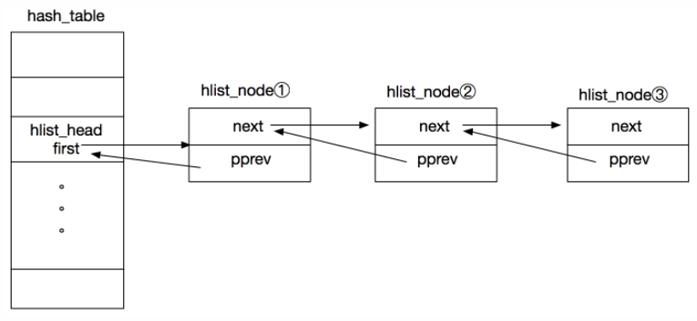

# LinxKernel链表

> Linux Kernle链表哲学：既然链表不能包含万事万物，那就让万事万物来包含链表。

1. LIST_HEAD和INIT_LIST_HEAD可以初始化一个链表。
   1. 前者只需要传入链表的名字叫就可以完成初始化，后者需要先定义出链表的实体。
   2. 链表的初始化是非常简单的，只需要将前驱和后继都指向自己就可以了。
2. List_add 可以在链表中增加节点，头插法
3. List_for_each函数可以遍历链表。
   1. 第一个参数代表的是位置，需要时list_head*类型，它其实是相当于临时变量。

## hlist_head/hlist_node结构解析

​		这两个用于散列表，分别表示列表头，和列表头所在的双向链表中的某项。

~~~c
struct hlist_head {
	struct hlist_node *first;
};
~~~

~~~c
struct hlist_node {
	struct hlist_node *next, **pprev;
};
~~~

Hash_table是数组，其中的元素类型是struct hlist_head，以hlist_head为链表头的链表，其中的节点hash的值是相同的，first指针指向的链表中的节点，然后节点的pprev指针指向hlist_head的first，节点的next指针指向节点2，以此类推。

 	这其实就是双向非循环链表。