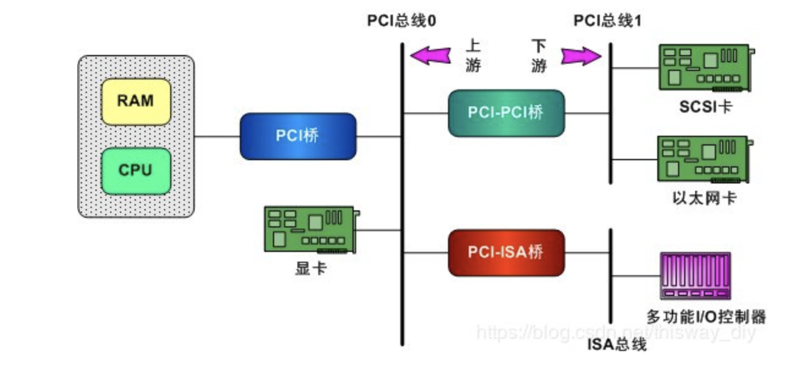

# Linux-PCI

## 基本概念

​	PCI设备驱动包含两个部分：

* Linux PCI设备驱动
* 设备驱动本身

Linux PCI驱动是内核自带的，我们需要完成的是设备驱动本身，比如网卡驱动等等。

PCI包含三种空间，PCI I/O空间和PCI内存空间，以及PCI配置空间，设备驱动本身主要用到的就是PCI I/O空间和PCI内存空间这两部分，而PCI配置文件是交给Linux PCI初始化使用的，用来配置PCI设备，比如中断号，内存基址等等。

### PCI接口的特征

* 更高的传输性能
* 替代ISA设备
* 平台无关性
* 多设备支持
* 存在配置空间

## Linux内核做了什么？

​	从概念就可看出，内核堆PCI设备进行枚举和配置，这些工作在内核启动初始化的时候完成。

PCI架构图：

​	枚举就是遍历找到所有的PCI设备，然后形成一个代表这些PCI总线和设备的数据结构，其中pci设备由`pci_dev`结构体来表示，pci总线由pci_bus结构体来表示。

​	配置：PCI设备中存在RAM和ROM地址空间，通常的控制/状态寄存器和数据寄存器往往是以ROM的形式出现的，同时在设备内部是由0开始编址的，当大量的设备同时存在的时候肯定会出现冲突，那么配置需要做的事情就是将这些地址映射到系统总线上，然后再进一步映射到内核的虚拟地址空间，那么配置就是映射到系统总线上的过程。从总线到内核虚拟地址空间的过程是通过设备自己完成的。

### 内核是怎么做的？

​	首先PCI设备的初始化和PC的BIOS等，其实内核可以自己做，但是在PC机子中如果存在pci总线，那么其bios就比如支持对pci总线进行操作，因此被称为pci bios，同时Linux早期也确实是使用bios进行pci设备的操作的，但是某些平台可能是没有bios的，比如一些嵌入式设备等等，反正一系列原因导致Linux 内核开始自己实现对于pci设备的操作，在其`make menuconfig`的操作里面提供了BIOS、MMconfig、Direct和Any四种选项，其中Direct的方式就是跑开bios自己实现初始化。

### PCI的枚举和配置

​	PCI配置里面存放的是配置组寄存器，因为在设备刚加电的时候，只会对配置文件作出反应。上电的时候I/O和内存等都处于关闭的状态。

​	PCI标准规定每个设备配置寄存器最多可以拥有256字节的地址空间，其中开头64字节的用途和格式是标准的，称为配置寄存器的头部。**系统中提供了一些机制可以检测在一个给定的PCI总线上所有可能的PCI配置寄存器头部，从而知道那个PCI插槽上现在有设备，这是通过PCI配置寄存器上面的某个域来完成的，一般是Vendor ID域，如果插槽为空那么会返回-1等错误信号。**在64字节里面pci头部分三种：

1. 0型：该头部一般用于普通的PCI设备
2. 1型：用于PCI -PCI桥设备
3. 2型：用于PCI- CardBlus（笔记本上用到的总线）桥

## 内核源代码表现

### PCI配置信息

~~~c
#include <linux/mod_devicetable.h>
/*驱动程序支持设备标识列表，通常是以结构体数组的形式出现，结束需要显式指定"{}"*/
struct pci_device_id {
        __u32 vendor, device;           /* PCI设备标识符 Vendor and device ID or PCI_ANY_ID*/
        __u32 subvendor, subdevice;     /* PCI设备型号标识符 Subsystem ID's or PCI_ANY_ID */
        __u32 class, class_mask;        /* PCI设备所属设备组类 (class,subclass,prog-if) triplet */
        kernel_ulong_t driver_data;     /* PCI驱动私有数据*/
};
/*初始化 仅配置vendor和device，子系统型号被设置成了 PCI_ANY_ID*/
#define PCI_DEVICE(vend,dev) \
        .vendor = (vend), .device = (dev), \
        .subvendor = PCI_ANY_ID, .subdevice = PCI_ANY_ID

/*设置PCI 设备主类标识，以及类掩码*/
#define PCI_DEVICE_CLASS(dev_class,dev_class_mask) \
        .class = (dev_class), .class_mask = (dev_class_mask), \
        .vendor = PCI_ANY_ID, .device = PCI_ANY_ID, \
        .subvendor = PCI_ANY_ID, .subdevice = PCI_ANY_ID

/*struct pci_device_id 信息导出到用户空间，type=pci name= 【struct pci_device_id的数组名称】*/
#define MODULE_DEVICE_TABLE(type,name)  MODULE_GENERIC_TABLE(type##_device,name)
#if defined(MODULE) || !defined(CONFIG_SYSFS)
#define MODULE_VERSION(_version) MODULE_INFO(version, _version)
#else
#define MODULE_VERSION(_version)                                        \
        static struct module_version_attribute ___modver_attr = {       \
                .mattr  = {                                             \
                        .attr   = {                                     \
                                .name   = "version",                    \
                                .mode   = S_IRUGO,                      \
                        },                                              \
                        .show   = __modver_version_show,                \
                },                                                      \
                .module_name    = KBUILD_MODNAME,                       \
                .version        = _version,                             \
        };                                                              \
        static const struct module_version_attribute                    \
        __used __attribute__ ((__section__ ("__modver")))               \
        * __moduleparam_const __modver_attr = &___modver_attr
#endif
~~~

### 访问配置空间

配置空间用于查找设备映射位置与IO空间的映射位置：

~~~c
#include <linux/pci.h> 
struct pci_bus {
        struct list_head node;          /* 总线节点链表*/
        struct pci_bus  *parent;        /* parent bus this bridge is on */
        struct list_head children;      /* 子总线列表*/
        struct list_head devices;       /* 总线设备列表*/
        struct pci_dev  *self;          /* bridge device as seen by parent */
        struct list_head slots;         /* 总线槽列表 */
        struct resource *resource[PCI_BRIDGE_RESOURCE_NUM];  /*获取配置空间 BASE_ADDR bar*/
        struct list_head resources;    

        struct pci_ops  *ops;           /* 配置访问控制函数集*/
        void            *sysdata;       /* hook for sys-specific extension */
        struct proc_dir_entry *procdir; /* 进程目录pci总线目录 */

        unsigned char   number;         /* 总线编号 */
        unsigned char   primary;        /* 主桥编号 */
        unsigned char   secondary;      /* 副桥编号*/
        unsigned char   subordinate;    /* 次级总线最大数量 */
        unsigned char   max_bus_speed;  /* 最大总线速率 */
        unsigned char   cur_bus_speed;  /* 当前总线速率 */

        char            name[48];       /*总线名称*/

        unsigned short  bridge_ctl;     /* manage NO_ISA/FBB/et al behaviors */
        pci_bus_flags_t bus_flags;      /* 子总线继承 */
        struct device           *bridge;
        struct device           dev;
        struct bin_attribute    *legacy_io; /* IO端口属性*/
        struct bin_attribute    *legacy_mem; /* IO内存属性*/
        unsigned int            is_added:1;
};
/*如果不能使用 struct pci_dev 任何时候都可以直接调用里面的函数
 *实际使用的 struct pci_bus * 和 unsigned int devfn，来自于pci_dev 中，
 */
static inline int pci_read_config_byte(const struct pci_dev *dev, int where, u8 *val)
{
        return pci_bus_read_config_byte(dev->bus, dev->devfn, where, val);
}
static inline int pci_read_config_word(const struct pci_dev *dev, int where, u16 *val)
{
        return pci_bus_read_config_word(dev->bus, dev->devfn, where, val);
}
static inline int pci_read_config_dword(const struct pci_dev *dev, int where,u32 *val)
{
        return pci_bus_read_config_dword(dev->bus, dev->devfn, where, val);
}

static inline int pci_write_config_byte(const struct pci_dev *dev, int where, u8 val)
{
        return pci_bus_write_config_byte(dev->bus, dev->devfn, where, val);
}
static inline int pci_write_config_word(const struct pci_dev *dev, int where, u16 val)
{
        return pci_bus_write_config_word(dev->bus, dev->devfn, where, val);
}
static inline int pci_write_config_dword(const struct pci_dev *dev, int where,u32 val)
{
        return pci_bus_write_config_dword(dev->bus, dev->devfn, where, val);
}
~~~

### 获取PCI I/O空间的位置

~~~c
#include <linux/pci.h>
/*pci_dev 获取配置空间中 BASE_ADDR bar 的第一个可用地址，返回地址unsigned long*/
#define pci_resource_start(dev, bar)    ((dev)->resource[(bar)].start)
/*pci_dev 获取配置空间中 BASE_ADDR bar 的最后一个可用地址，返回地址unsigned long*/
#define pci_resource_end(dev, bar)      ((dev)->resource[(bar)].end)
~~~

### 注册PCI驱动流程

1. 填充pci设备结构体，一些关键的函数指针

~~~c
#include <linux/pci.h>
/*1.定义并填充PCI设备信息结构，*/
struct pci_driver {
        /*内核实现链表*/
        struct list_head node;
        /*[必选参数]设备名称 显示在 /proc/bus/pci/device 目录下*/
        const char *name; 
        /*[必选参数]硬件PCI设备接入功能列表 数组首地址指定*/                          
        const struct pci_device_id *id_table;
        /*[必选参数]当新设备插入后，初始化 */
        int  (*probe)  (struct pci_dev *dev, const struct pci_device_id *id);
        /*[必选参数]设备移除清理函数 */
        void (*remove) (struct pci_dev *dev); 
        /*[可选函数]当指向的pci_dev设备，被挂起时执行 */
        int  (*suspend) (struct pci_dev *dev, pm_message_t state);
        int  (*suspend_late) (struct pci_dev *dev, pm_message_t state);
         /*恢复挂起的PCI设备 */
        int  (*resume) (struct pci_dev *dev);
        int  (*resume_early) (struct pci_dev *dev);
        /*关机时安全的卸载设备*/
        void (*shutdown) (struct pci_dev *dev);
        struct pci_error_handlers *err_handler;
        struct device_driver    driver;
        struct pci_dynids dynids;
};
~~~

2. 注册PCI驱动程序

~~~c
/*注册PCI设备到内核中*/
#define pci_register_driver(driver)             \
        __pci_register_driver(driver, THIS_MODULE, KBUILD_MODNAME)
/*核心函数 */
int __pci_register_driver(struct pci_driver *drv, struct module *owner,const char *mod_name)
{
        int error;

        /* initialize common driver fields */
        drv->driver.name = drv->name;
        drv->driver.bus = &pci_bus_type;
        drv->driver.owner = owner;
        drv->driver.mod_name = mod_name;
        
        spin_lock_init(&drv->dynids.lock);
        INIT_LIST_HEAD(&drv->dynids.list);

        /* register with core */
        error = driver_register(&drv->driver);
        if (error)
                goto out;
        /*动态分配PCI ID,写入文件为 new_id*/
        error = pci_create_newid_files(drv);
        if (error)
                goto out_newid;
out:              
        return error;

out_newid:
        driver_unregister(&drv->driver);
        goto out;
}        
~~~

Func : 将注册PCI设备到内核中
args1: 驱动程序信息，于第一步填充完成；
args2: 模块所有者，常见的THIS_MODULE；
args3: 模块名称，只能用这个“KBUILD_MODNAME”；
retval: 成功 0 失败返回错误码

3. PCI驱动注销程序

~~~c
void
pci_unregister_driver(struct pci_driver *drv)
{
        pci_remove_newid_files(drv);
        driver_unregister(&drv->driver);
        pci_free_dynids(drv);
}
~~~

4. 激活PCI设备驱动

~~~c
int pci_enable_device(struct pci_dev *dev)
{
        return __pci_enable_device_flags(dev, IORESOURCE_MEM | IORESOURCE_IO);
}
/*核心函数*/
static int __pci_enable_device_flags(struct pci_dev *dev,resource_size_t flags)
{
        int err;
        int i, bars = 0;
        if (dev->pm_cap) {
                u16 pmcsr;
                pci_read_config_word(dev, dev->pm_cap + PCI_PM_CTRL, &pmcsr);
                dev->current_state = (pmcsr & PCI_PM_CTRL_STATE_MASK);
        }

        if (atomic_add_return(1, &dev->enable_cnt) > 1)
                return 0;               /* already enabled */

        /* only skip sriov related */
        for (i = 0; i <= PCI_ROM_RESOURCE; i++)
                if (dev->resource[i].flags & flags)
                        bars |= (1 << i);
        for (i = PCI_BRIDGE_RESOURCES; i < DEVICE_COUNT_RESOURCE; i++)
                if (dev->resource[i].flags & flags)
                        bars |= (1 << i);

        err = do_pci_enable_device(dev, bars);
        if (err < 0)
                atomic_dec(&dev->enable_cnt);
        return err;
}
~~~

